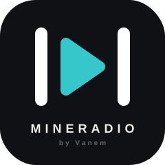

<h1 align="center">Mineradio+</h1>

> **非官方二改增强版** — 基于 [Mineradio](https://github.com/XxHuberrr/Mineradio)（GPL-3.0）修改，按个人偏好持续调整。
>
> ⚠️ 本项目为个人修改版，仅根据 **本人使用习惯和审美** 进行调整，与他人无关，非官方发布。
>
> 如需原版请访问：[github.com/XxHuberrr/Mineradio](https://github.com/XxHuberrr/Mineradio)

<p align="center">
  
</p>

## ✨ 本版改动（陆续添加中）

### 🎬 PKG 多层壁纸渲染 — 原生 Wallpaper Engine 场景引擎

- **37 层纹理合成**：WebGL 逐层渲染所有纹理，支持 opaque / additive 混合模式、透明度、旋转、缩放、色调变换
- **CanvasTexture 注入**：合成结果通过 `THREE.CanvasTexture` 注入 3D 场景背景层，粒子效果自然覆盖在壁纸之上
- **宽高比自适配**：场景等比缩放填充屏幕，短边对齐、长边居中裁切，不拉伸变形
- **W/E/Q 交互编辑**：
  - **W**：进入/退出编辑模式（退出时自动保存）
  - **Q**：从未使用纹理池中添加图层
  - **E**：删除最顶层图层
- **编辑持久化**：localStorage 自动保存每层可见性和透明度，重启后完整恢复
- **启动自动恢复**：重新打开应用自动加载上次壁纸的多层渲染 + 编辑状态

### 🖼 PKG 壁纸库 — 一键换播放器背景

- 自动扫描 Wallpaper Engine 的 workshop 壁纸目录（Steam 创意工坊）
- 缩略图网格浏览，**点击即设为播放器背景**
- **三级年龄分级**：全年龄 / 可疑 / 成人严格分类过滤
- 支持自定义壁纸库目录（多文件夹）
- 启动时自动恢复上次使用的壁纸 + 编辑状态
- RePKG 自动解包 `scene.pkg` 获取高清纹理 + 视频文件

### 🎛 SMTC 系统媒体控件支持

- 集成 **Media Session API**，与 Windows 10/11 系统媒体控件（SMTC）深度对接
- **任务栏音量弹出面板** 显示：歌曲名、歌手、专辑封面、进度条
- **键盘媒体键** 直接控制：播放/暂停、上一首、下一首
- **锁屏界面** 同步显示当前播放信息
- 快进/快退 10 秒手势支持
- 无需额外安装任何组件，开箱即用

### 其他增强

- 应用名称改为 `Mineradio+`，可与原版共存安装
- Windows AppUserModelID 独立，互不冲突
- KRC 歌词解密（酷狗 XOR + zlib）
- 每日一言主页
- PKG 场景格式参考 [win-wallpaper-engine](https://github.com/VanemKrAu/win-wallpaper-engine)

_更多改动随个人使用逐步加入。_

## 原版核心特性

Mineradio 是一款 Windows 桌面沉浸式音乐播放器，天气电台、搜索播放、歌词舞台、粒子视觉和 3D 歌单架组合成一个更接近现场感的私人音乐空间。

- Open-Meteo 天气电台，根据当前位置、城市和天气 mood 生成更合适的播放队列
- 首页包含天气电台、每日推荐、私人电台、继续听、听歌画像和我的歌单入口
- Wallpaper 银河首页背景，未播放状态保持干净的星河氛围
- 播放后切换到 Emily / 默认播放态视觉，歌词舞台与粒子舞台同步工作
- 基于节奏的电影镜头视觉系统
- 面向长播客和 DJ 曲目的专属视觉模式
- 歌词舞台、自定义歌词、歌词位置与视觉控制
- 自定义专辑封面上传与裁剪
- 右键唤起 3D 歌单架，支持歌单队列浏览
- 网易云音乐账号、搜索、歌单、播客等体验接入
- QQ 音乐搜索、登录态与音源补充接入
- 酷狗音乐搜索、登录态与音源补充接入
- GitHub Releases 更新检测与下载入口

## 构建安装包

```bash
npm install
npm run build:win
```

产物位于 `dist/Mineradio+-*-Setup.exe`。

## 版权说明

- 本项目基于 [Mineradio](https://github.com/XxHuberrr/Mineradio)（GPL-3.0）修改
- 修改内容：SMTC 系统媒体控件支持、PKG 多层壁纸渲染与编辑、壁纸库扫描与一键换背景
- PKG 解包使用 [RePKG](https://github.com/NotScuffed/RePKG)（MIT）提取纹理
- 壁纸库功能参考 [wallpaper_box](https://github.com/SNP-LDN/wallpaper_box)（MIT 授权）
- 原版作者：[XxHuberrr](https://github.com/XxHuberrr)
- MR Logo、Mineradio 名称、界面视觉设计与原创视觉表达归原版作者所有
- 本增强版遵循 **GPL-3.0** 协议开源
- 第三方依赖和第三方服务分别遵循其各自授权与服务条款

## 致谢

感谢 [XxHuberrr](https://github.com/XxHuberrr) 创造了 Mineradio 这样一个优秀的开源音乐播放器。

感谢 [SNP-LDN/wallpaper_box](https://github.com/SNP-LDN/wallpaper_box) 提供了本地壁纸库扫描管理的优秀参考实现。

感谢 [NotScuffed/RePKG](https://github.com/NotScuffed/RePKG) 提供了 Wallpaper Engine PKG 文件解包工具。

## 与官方版的区别

| 方面 | 官方版 | 本增强版 |
|------|--------|----------|
| 应用名称 | Mineradio | Mineradio+ |
| PKG 多层渲染 | ❌ 无 | ✅ 37 层 WebGL 合成 |
| 壁纸编辑 | ❌ 无 | ✅ W/E/Q 交互编辑 |
| SMTC 支持 | ❌ 无 | ✅ 完整支持 |
| 壁纸库 | ❌ 无 | ✅ 本地 WE 壁纸管理 |
| 酷狗音乐 | ❌ 无 | ✅ 搜索/歌单/播放/歌词 |
| KRC 歌词解密 | ❌ 无 | ✅ 自动识别 |
| 应用 ID | com.mineradio.desktop | com.mineradio-plus.desktop |
| 可共存安装 | ❌ | ✅ |
| 维护者 | XxHuberrr | VanemKrAu |
